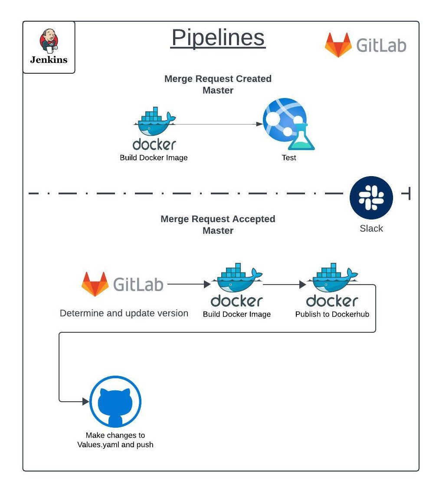

# Jenkins-GitLab CI/CD Pipeline Project

 

## Overview

This project automates the deployment of a cloud infrastructure using Terraform, with continuous integration and deployment pipelines managed by Jenkins and GitLab. The main components include:

- Jenkins (Server-Agent)
- GitLab Server
- EKS (Elastic Kubernetes Service)
- Terraform
- Slack for notifications

## Table of Contents
[readme.md](..%2Fyossi.shalumov%2Fproject%2Freadme.md)
1. [Infrastructure Overview](#infrastructure-overview)
2. [Terraform Components](#terraform-components)
    - [VPC and Subnets](#vpc-and-subnets)
    - [Security Groups](#security-groups)
    - [Instances](#instances)
    - [Load Balancer](#load-balancer)
    - [EKS Cluster](#eks-cluster)
3. [Pipelines](#pipelines)
    - [Branches Pipeline](#Branches-pipeline)
    - [Master Pipeline](#Master-pipeline)
4. [Application](#application)
5. [Tests](#tests)
6. [Monitoring](#AWS-CloudWatch-Monitoring)
7. [Configurations](#configurations)
     - [Jenkins](#jenkins)
     - [GitLab](#gitlab)

## Infrastructure Overview

The infrastructure is entirely managed by Terraform and includes the following components:

## Terraform Components

### VPC and Subnets

- VPC with 3 private subnets and 3 public subnets.

### Security Groups

- Security Group for Jenkins and GitLab instances.
- Security Group for the bastion host.

### Instances

- `Jenkins Agent`     : private subnet.
- `Jenkins Controller`: private subnet.
- `GitLab`            : private subnet.
- `Bastion Host`      : public subnet.

### Load Balancer

- Application Load Balancer with listeners for Jenkins and GitLab.
- `Jenkins` : port 8080
- `Gitlab`  : port 80

### EKS Cluster

- EKS cluster with nodes in private subnets and necessary IAM roles.

## Pipelines

### Branches Pipeline
- Stages :
  - Build Docker Image
  - Test Docker Image
  
- `Trigger` : Merge Request to Master branch.

### Master Pipeline

- Stages:
    - Determines the source branch of the merge request.
    - Updates the version depending on source branch (Major for `release/*`, Minor for `feature/*`, Patch for `hotfix/*`).
    - Builds the artifact (Docker image).
    - Pushes the Docker image to Docker Hub ([yossizxc/weather](https://hub.docker.com/repository/docker/yossizxc/weather/general)).
    - Changes the kubeconfig context to the cluster using `aws eks update-kubeconfig`.
    - Deploys the new Docker image on the two nodes.

- `Trigger`: Accepted Merge Request to Master Branch. 

## Application

- **Weather API:**
    - A Flask application using Gunicorn as a WSGI server.

## Tests

- **Connectivity Test:**
    - Checks if the server is running properly by sending a request to the localhost on the specified port.
  
- **Code Linting:**
  - A pre-push Git hook runs pylint to ensure code quality before code is pushed to the repository.

## AWS CloudWatch Monitoring

This project uses AWS CloudWatch to monitor the infrastructure:

- **EC2 Instance Monitoring:**
    - Collects metrics such as CPU utilization, disk usage, and memory usage.
    - Configured using the AWS CloudWatch Agent.

- **CloudWatch Alarms:**
    - Alarms set up to notify when thresholds (e.g., high CPU usage) are breached.
    - Notifications sent via SNS to your email.

## Configurations

### Jenkins

- **Credentials:**
    - GitLab account for SCM connection.
    - AWS Credentials.
    - DockerHub Credentials.
    - SSH key or other configurations for agent-controller connection.
    - Slack Credentials

- **Pipelines:**
    - Create two pipelines with the relevant configurations:
        - One for created and updated merge requests.
        - One for accepted merge requests (includes additional parameters).

- **Shared Groovy Library:**
    - Used to implement and maintain the versioning scheme and configuration.

### GitLab

- **Webhooks:**
    - One webhook for the branch pipeline (builds and tests).
    - Another webhook for the deployment pipeline (triggered upon merge request acceptance).

